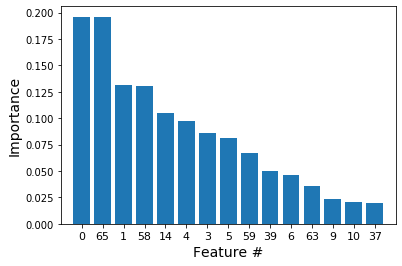

# aud_etiology_classifier

Script classifying unknown etiologies in audiology dataset (below) using Naive Bayes model.

Trains on known etiologies, then implemented on data from unknown etiologies.

Uses Audiology (Standardized) Data Set available from:
https://archive.ics.uci.edu/ml/datasets/Audiology+%28Standardized%29

