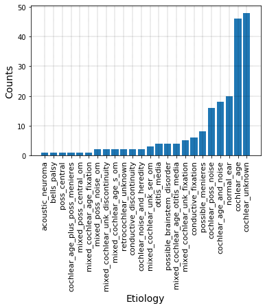
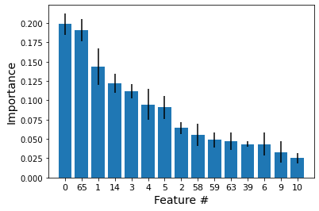

# etiology_classifier

Script classifies unknown etiologies in audiology datasets using Naive Bayes models.

Models trained on known etiologies (with feature importance calculation), then implemented on data from unknown etiologies.

This script uses the Audiology (Standardized) Data Set available from:
https://archive.ics.uci.edu/ml/datasets/Audiology+%28Standardized%29

 

