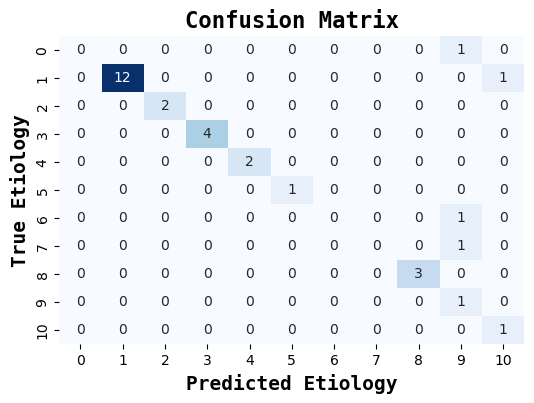

# etiology_classifier

## Classifies unknown etiologies in audiology dataset using Naive Bayes

* "A small project using a Naive Bayes classifier to predict audiological etiologies based on the Audiology (Standardized) Data Set from UCI. This project explores feature importance and handles both known and unknown etiologies using basic ML.

* For many patients in an audiology clinic, it is unclear what disease or condition causes their hearing loss. This is apparent in the Audiology (Standardized) Data Set, available from: https://archive.ics.uci.edu/ml/datasets/Audiology+%28Standardized%29

 

* This code trains a model on patients with known etiologies with 80% accuracy, which is then applied to patients with unknown etiologies.

* Feature selection is calculated to determine the most important predictors of etiology.

